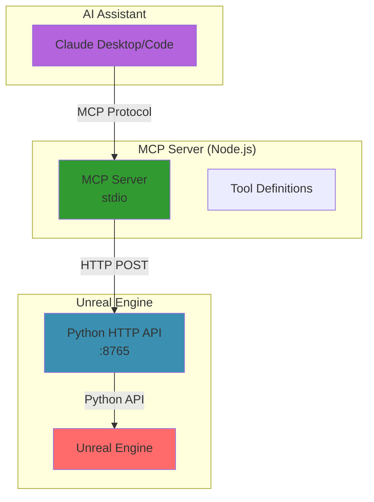

# UEMCP - Unreal Engine Model Context Protocol Server


A Model Context Protocol (MCP) server that provides AI models with deep integration capabilities for Unreal Engine projects. UEMCP bridges the gap between AI-powered development tools and Unreal Engine's complex ecosystem, enabling intelligent assistance for game development workflows.

<!-- START doctoc generated TOC please keep comment here to allow auto update -->
<!-- DON'T EDIT THIS SECTION, INSTEAD RE-RUN doctoc TO UPDATE -->

- [UEMCP - Unreal Engine Model Context Protocol Server](#uemcp---unreal-engine-model-context-protocol-server)
  - [Architecture](#architecture)
    - [High-Level Architecture](#high-level-architecture)
    - [Data Flow](#data-flow)
    - [Directory Structure](#directory-structure)
  - [Installation](#installation)
    - [Prerequisites](#prerequisites)
    - [🚀 Quick Start (2 minutes)](#-quick-start-2-minutes)
    - [Alternative Installation Methods](#alternative-installation-methods)
  - [Configuration](#configuration)
    - [Environment Variables](#environment-variables)
    - [Claude Desktop Configuration](#claude-desktop-configuration)
  - [🔧 Troubleshooting](#-troubleshooting)
  - [Available Tools](#available-tools)
    - [AI Client Setup](#ai-client-setup)
      - [Claude Desktop](#claude-desktop)
      - [Claude Code (claude.ai/code)](#claude-code-claudeaicode)
      - [Cursor](#cursor)
  - [Available Tools](#available-tools-1)
    - [Current Implementation](#current-implementation)
      - [Asset Management](#asset-management)
      - [Blueprint System](#blueprint-system)
      - [Project Management](#project-management)
    - [Planned Tools (Coming Soon)](#planned-tools-coming-soon)
      - [Asset Management](#asset-management-1)
      - [Blueprint System](#blueprint-system-1)
      - [Level Editing](#level-editing)
      - [Code Generation](#code-generation)
      - [Project Management](#project-management-1)
  - [Usage Examples](#usage-examples)
    - [Listing Assets](#listing-assets)
    - [Creating Blueprints](#creating-blueprints)
    - [Project Creation (Mock)](#project-creation-mock)
  - [Development](#development)
    - [Plugin Architecture](#plugin-architecture)
      - [Plugin Structure](#plugin-structure)
    - [Development Workflow](#development-workflow)
      - [1. Making Changes to the Plugin](#1-making-changes-to-the-plugin)
      - [2. Helper Functions](#2-helper-functions)
      - [3. Adding New Commands](#3-adding-new-commands)
    - [Available MCP Tools](#available-mcp-tools)
    - [Actor Spawning](#actor-spawning)
    - [Testing Changes](#testing-changes)
    - [Debugging](#debugging)
    - [Best Practices](#best-practices)
    - [Contributing](#contributing)
  - [Supported Unreal Engine Versions](#supported-unreal-engine-versions)
  - [Roadmap](#roadmap)
    - [Phase 1 - Core Foundation ✅](#phase-1---core-foundation-)
    - [Phase 2 - Advanced Features 🚧](#phase-2---advanced-features-)
    - [Phase 3 - Ecosystem Integration 📋](#phase-3---ecosystem-integration-)
  - [Troubleshooting](#troubleshooting)
    - [Common Issues](#common-issues)
    - [Debug Mode](#debug-mode)
  - [License](#license)
  - [Acknowledgments](#acknowledgments)
  - [Support](#support)

<!-- END doctoc generated TOC please keep comment here to allow auto update -->

## Architecture

### High-Level Architecture



### Data Flow

1. **AI Assistant** (Claude) sends MCP commands via stdio to the Node.js server
2. **MCP Server** validates commands and makes HTTP requests to Unreal Engine
3. **Python HTTP API** receives requests and executes them via Unreal's Python API
4. Results flow back through the same chain

**Note**: The plugin is pure Python - no C++ compilation required. The HTTP API runs on a background thread and uses a queue to execute commands safely on Unreal's main thread.

### Directory Structure

```
UEMCP/
├── server/           # MCP server implementation (Node.js)
│   ├── tools/        # UE-specific MCP tools
│   ├── resources/    # Project resources and templates
│   └── handlers/     # Request handlers
├── plugin/           # Unreal Engine plugin (C++)
│   ├── Source/       # C++ source code
│   ├── Content/      # Plugin assets
│   └── Config/       # Plugin configuration
├── python/           # Python utilities and bindings
│   ├── ue_api/       # Unreal Python API wrappers
│   ├── tools/        # Development tools
│   └── examples/     # Usage examples
└── docs/            # Documentation
```

## Installation

### Prerequisites
- Node.js 18+ and npm
- Unreal Engine 5.1+ (for full functionality)
- Python 3.11 (matches UE 5.4+ built-in version, optional for extended features)
- Git

### 🚀 Quick Start (2 minutes)

1. **Clone and initialize**:
   ```bash
   git clone https://github.com/atomantic/UEMCP.git
   cd UEMCP
   node init.js
   ```

   That's it! The init script will:
   - ✅ Install all dependencies
   - ✅ Build the MCP server
   - ✅ Configure Claude Desktop automatically
   - ✅ Optionally configure Claude Code (claude.ai/code)
   - ✅ Set up your Unreal Engine project path
   - ✅ Optionally install the UEMCP plugin to your project
   - ✅ Create test scripts

   **Advanced options**:
   ```bash
   # Install with plugin to specific project
   node init.js --project "/path/to/project" --install-plugin
   
   # Configure for Claude Code (claude.ai/code)
   node init.js --claude-code
   
   # Non-interactive installation
   node init.js --project "/path/to/project" --no-interactive --install-plugin
   
   # Server-only setup (no Claude config)
   node init.js --skip-claude
   ```

2. **Restart Claude Desktop** and test:
   - Say: "List available UEMCP tools"
   - Or: "Show me the assets in my Unreal project"

### Alternative Installation Methods

<details>
<summary>Platform-specific scripts</summary>

**macOS/Linux:**
```bash
./init.sh
```

**Windows PowerShell:**
```powershell
.\init.ps1
```
</details>

<details>
<summary>Manual installation</summary>

1. Install dependencies:
   ```bash
   cd server && npm install
   pip install -r requirements-dev.txt  # For local development with UE
   # OR
   pip install -r requirements-ci.txt   # For CI/CD or without UE
   ```

2. Build the server:
   ```bash
   npm run build
   ```

3. Configure Claude Desktop:
   - Copy `claude-desktop-config.example.json` to:
     - macOS: `~/Library/Application Support/Claude/claude_desktop_config.json`
     - Windows: `%APPDATA%\Claude\claude_desktop_config.json`
     - Linux: `~/.config/claude/claude_desktop_config.json`
   - Update paths in the config file

4. Set environment variables:
   ```bash
   export UE_PROJECT_PATH="/path/to/your/unreal/project"
   ```
</details>

## Configuration

### Environment Variables

```bash
# Required
export UE_PROJECT_PATH="/path/to/your/unreal/project"

# Optional
export UE_INSTALL_LOCATION="/path/to/unreal/engine"
export DEBUG="uemcp:*"  # Enable debug logging
```

See [docs/environment-setup.md](docs/environment-setup.md) for detailed configuration options.

### Claude Desktop Configuration

The init script automatically configures Claude Desktop. For manual setup, see [claude-desktop-config.example.json](claude-desktop-config.example.json).

## 🔧 Troubleshooting

<details>
<summary>Claude doesn't see UEMCP tools</summary>

1. Ensure Claude Desktop is fully restarted (not just closed)
2. Check the config file exists:
   - macOS: `~/Library/Application Support/Claude/claude_desktop_config.json`
   - Windows: `%APPDATA%\Claude\claude_desktop_config.json`
3. Verify the server path in the config is correct
4. Run `node test-connection.js` to test the server locally
</details>

<details>
<summary>"Python not found" warning</summary>

Python is optional. Core features work without it. To enable Python features:
- Install Python 3.11 (to match UE 5.4+ built-in Python)
- For local development with Unreal Engine: `pip install -r requirements-dev.txt`
- For CI/CD or without Unreal Engine: `pip install -r requirements-ci.txt`
</details>

<details>
<summary>Build errors during init</summary>

1. Ensure Node.js 18+ is installed: `node --version`
2. Clear npm cache: `npm cache clean --force`
3. Delete `node_modules` and try again
4. Check for TypeScript errors: `cd server && npm run build`
</details>

## Available Tools

Once connected, Claude can use these UEMCP tools:

### Project Management
- **project_create** - Create new Unreal Engine projects
- **project_info** - Get information about the current project

### Asset Management  
- **asset_list** - List and filter project assets
- **asset_info** - Get detailed information about an asset (dimensions, vertices, materials)

### Actor Management
- **actor_spawn** - Spawn actors using any static mesh or blueprint
- **actor_delete** - Delete actors from the level by name
- **actor_modify** - Modify actor location, rotation, or scale

### Level Management
- **level_actors** - List all actors in the current level
- **level_save** - Save the current level

### Viewport
- **viewport_screenshot** - Take a screenshot of the current viewport
- **viewport_camera** - Control viewport camera position and orientation
- **viewport_mode** - Switch between perspective and orthographic views (top, bottom, left, right, front, back)
- **viewport_focus** - Focus viewport on a specific actor (equivalent to pressing F)
- **viewport_render_mode** - Change rendering mode (wireframe, unlit, lit, detail_lighting, lighting_only, light_complexity, shader_complexity)

### System
- **restart_listener** - Restart the Python listener for hot reload of code changes

### AI Client Setup

#### Claude Desktop
Add to your `claude_desktop_config.json` (located in `~/Library/Application Support/Claude/` on macOS):
```json
{
  "mcpServers": {
    "uemcp": {
      "command": "node",
      "args": ["/path/to/UEMCP/server/dist/index.js"],
      "env": {
        "UE_PROJECT_PATH": "/path/to/your/project.uproject"
      }
    }
  }
}
```

#### Claude Code (claude.ai/code)
Use the `claude mcp` CLI or configure manually:

**Option 1: Using claude mcp CLI**
```bash
# Install claude-mcp if not already installed
npm install -g @anthropic/claude-mcp

# From the UEMCP directory, capture the path
UEMCP_DIR=$(pwd)

# Add the UEMCP server
claude mcp add uemcp node "${UEMCP_DIR}/server/dist/index.js" \
  -e "UE_PROJECT_PATH=/path/to/your/project.uproject"

# Verify configuration
claude mcp list
```

**Option 2: Manual configuration**
Add to `~/.config/claude/mcp_servers.json`:
```json
{
  "servers": {
    "uemcp": {
      "command": "node",
      "args": ["/path/to/UEMCP/server/dist/index.js"],
      "env": {
        "UE_PROJECT_PATH": "/path/to/your/project.uproject"
      },
      "enabled": true
    }
  }
}
```

#### Cursor
Configure in your workspace settings:
```json
{
  "mcp.servers": [
    {
      "name": "uemcp",
      "command": ["node", "/path/to/UEMCP/server/dist/index.js"]
    }
  ]
}
```

## Available Tools

### Current Implementation
The following tools are currently implemented and available:

#### Project Management
- `project_info` - Get comprehensive project information
  - Project name, directory, and engine version
  - Current level information
  - Connection status
  
- `project_create` - Create new Unreal Engine projects (mock implementation)
  - Choose project template (Blank, FirstPerson, ThirdPerson, VR, TopDown)
  - Set project name and location
  - Specify engine version

#### Asset Management
- `asset_list` - List assets in the Unreal Engine project with filtering options
  - Filter by path (e.g., `/Game/Blueprints`)
  - Filter by asset type (StaticMesh, Blueprint, Material, Texture2D, etc.)
  - Limit number of results
  - Shows asset name, type, and full path

#### Level Editing
- `actor_spawn` - Spawn actors in the level using any asset
  - Spawn static meshes at specific locations
  - Spawn blueprint actors
  - Set location, rotation, and scale
  - Custom actor naming
  
- `level_actors` - List all actors in the current level
  - Filter actors by name or class
  - Get actor location, class, and properties
  - Limit number of results
  
- `level_save` - Save the current level
  - Saves all changes made to the level

### Planned Tools (Coming Soon)

#### Asset Management
- `asset_import` - Import external assets into the project
- `asset_export` - Export assets from the project
- `asset_delete` - Remove assets from the project
- `material_create` - Generate new materials
- `texture_modify` - Edit texture properties

#### Blueprint System
- `blueprint_create` - Create new Blueprint classes
  - Specify parent class (Actor, Pawn, Character, GameMode)
  - Set custom blueprint name and path
  - Automatic compilation
- `blueprint_modify` - Edit existing Blueprint graphs
- `blueprint_compile` - Compile and validate Blueprints
- `blueprint_analyze` - Analyze Blueprint complexity and dependencies

#### Advanced Level Editing
- `level_create` - Generate new levels
- `actor_modify` - Modify existing actor properties
- `landscape_create` - Create terrain and landscapes
- `landscape_modify` - Edit terrain and landscapes
- `lighting_build` - Build lighting for levels
- `foliage_paint` - Add foliage and vegetation

#### Code Generation
- `cpp_class_create` - Generate C++ classes with UE boilerplate
- `interface_create` - Create UE interfaces
- `bindings_generate` - Create Python/Blueprint bindings
- `code_refactor` - Intelligent code refactoring

#### Build & Deployment
- `project_build` - Build the project
- `project_package` - Package for distribution
- `project_cook` - Cook content for specific platforms
- `tests_run` - Execute automated tests

#### Animation & Cinematics
- `sequence_create` - Create level sequences
- `animation_import` - Import animation data
- `camera_animate` - Create camera movements

## Usage Examples

### Getting Project Information
With Claude Desktop or Claude Code, you can use natural language:
- "What Unreal project am I connected to?"
- "Show me the project info"
- "What engine version is this project using?"

### Listing Assets
Natural language examples:
- "Show me all static meshes in the ModularOldTown folder"
- "List assets in /Game/Characters"
- "What materials are in the project?"

Direct tool usage:
```json
{
  "tool": "asset_list",
  "arguments": {
    "path": "/Game/ModularOldTown",
    "assetType": "StaticMesh",
    "limit": 50
  }
}
```

### Spawning Actors
Natural language examples:
- "Spawn a wall at location 1000, 500, 100"
- "Place the SM_FlatWall_3m mesh in the level"
- "Create a cube at the origin"

Direct tool usage:
```json
{
  "tool": "actor_spawn",
  "arguments": {
    "assetPath": "/Game/ModularOldTown/Meshes/Walls/SM_FlatWall_3m",
    "location": [1000, 500, 100],
    "rotation": [0, 90, 0],
    "scale": [1, 1, 1],
    "name": "MyWall"
  }
}
```

### Listing Level Actors
Natural language examples:
- "Show me all actors in the level"
- "Find actors with 'Foundation' in their name"
- "List all StaticMeshActors"

### Saving the Level
Natural language examples:
- "Save the current level"
- "Save my changes"

### Project Creation (Mock - for testing)
```json
{
  "tool": "project_create",
  "arguments": {
    "projectName": "MyNewGame",
    "projectPath": "/Users/username/Documents/Unreal Projects",
    "engineVersion": "5.6",
    "template": "FirstPerson"
  }
}
```

## Development

### Plugin Architecture

The UEMCP plugin has evolved to a **content-only plugin** architecture, eliminating C++ compilation requirements while maintaining full functionality through Unreal Engine's Python API.

#### Plugin Structure
```
plugin/
├── UEMCP.uplugin            # Plugin descriptor (content-only)
├── Content/
│   └── Python/
│       ├── init_unreal_simple.py    # Auto-startup script
│       ├── uemcp_listener_fixed.py  # HTTP listener (main functionality)
│       └── uemcp_helpers.py         # Developer utilities
└── Source/                  # (Removed - no C++ compilation needed)
```

### Development Workflow

#### 1. Making Changes to the Plugin

When developing new features or fixing bugs in the UEMCP plugin:

```bash
# Edit files in the git repository
cd /path/to/UEMCP_dev
# Make your changes to plugin files

# Copy to your UE project for testing
cp -r plugin/* "/path/to/UE/Project/Plugins/UEMCP/"

# In Unreal Engine Python console:
restart_listener()  # Reload changes without restarting UE
```

#### 2. Helper Functions

The plugin includes convenient helper functions for development:

```python
# In UE Python console:
restart_listener()  # Reload the listener with code changes
reload_uemcp()      # Alias for restart_listener()
status()            # Check if listener is running
stop_listener()     # Stop the listener
start_listener()    # Start the listener
```

#### 3. Adding New Commands

To add new commands to the listener, edit `uemcp_listener_fixed.py`:

```python
# Example: Add a new command
elif cmd_type == 'your.command':
    params = command.get('params', {})
    # Your implementation here
    return {
        'success': True,
        'data': your_data
    }
```

Then update the MCP server tool in `server/src/tools/`:

```typescript
// Create your-tool.ts
export const yourTool = {
  definition: {
    name: 'your_command',
    description: 'Description of your command',
    inputSchema: {
      // Define parameters
    }
  },
  handler: async (args) => {
    const result = await bridge.executeCommand({
      type: 'your.command',
      params: args
    });
    // Handle result
  }
};
```

### Available MCP Tools

Current implementation includes:

- **project_create** - Create new UE projects (mock implementation for testing)
- **project_info** - Get project information
- **asset_list** - List and filter project assets  
- **asset_info** - Get asset dimensions and properties
- **actor_spawn** - Spawn actors with any static mesh or blueprint
- **actor_delete** - Delete actors by name
- **actor_modify** - Change actor transform
- **level_actors** - List actors in the current level
- **level_save** - Save the current level
- **viewport_screenshot** - Capture viewport screenshots (1280x720)
- **viewport_camera** - Move and orient the viewport camera
- **viewport_mode** - Switch between perspective and orthographic views
- **viewport_focus** - Focus viewport on a specific actor
- **viewport_render_mode** - Change viewport rendering mode (wireframe, unlit, lit, etc.)
- **test_connection** - Test connection to Python listener and diagnose issues

### Actor Spawning

The enhanced `actor_spawn` tool supports:

```python
# Spawn any static mesh
mcp__uemcp__actor_spawn(
    assetPath="/Game/ModularOldTown/Meshes/Walls/SM_FlatWall_3m",
    location=[x, y, z],
    rotation=[pitch, yaw, roll],  # in degrees
    scale=[1, 1, 1],
    name="MyWall"
)

# Spawn blueprints
mcp__uemcp__actor_spawn(
    assetPath="/Game/Blueprints/BP_MyActor",
    location=[0, 0, 100]
)
```

### Testing Changes

1. **Test Before Pushing** (mimics CI exactly):
   ```bash
   # Run full CI test suite locally
   ./test-ci-locally.sh
   
   # Quick TypeScript-only tests
   ./test-ts.sh
   ```

2. **Individual Test Commands**:
   ```bash
   # TypeScript/Node.js tests
   cd server
   npm run lint          # ESLint
   npm run typecheck     # TypeScript type checking
   npm test              # Jest unit tests
   
   # Python tests
   cd python
   flake8 .              # Python linting
   mypy . --ignore-missing-imports  # Type checking
   python -m pytest      # Unit tests
   ```

3. **Integration Testing**:
   ```bash
   # Test connection
   node test-connection.js
   
   # Test with UE project running
   UE_PROJECT_PATH="/path/to/project" npm start
   ```

3. **In-Editor Testing**:
   - Use the Python console to test commands directly
   - Check Output Log for UEMCP messages
   - Use `status()` to verify listener state

### Debugging

Enable debug logging:

```bash
# For MCP server
DEBUG=uemcp:* npm start

# In UE Python console
import uemcp_listener_fixed
uemcp_listener_fixed.server_running  # Check if running
```

Common debug commands:
```python
# Check listener URL
print("http://localhost:8765/")

# Test a command manually
import json
import requests
response = requests.post('http://localhost:8765/', 
    json={'type': 'project.info', 'params': {}})
print(response.json())
```

### Best Practices

1. **Always sync changes** between UE project and git repo:
   ```bash
   # After testing in UE, copy back to git
   cp -r "/path/to/UE/Project/Plugins/UEMCP/"* plugin/
   ```

2. **Use restart_listener()** instead of restarting UE when testing

3. **Add new tools** in both Python listener and MCP server

4. **Document new commands** in the listener's available_commands list

5. **Test commands** via Python console before using through MCP

### Contributing
1. Fork the repository
2. Create a feature branch (`git checkout -b feature/amazing-feature`)
3. Test thoroughly in Unreal Engine
4. Sync changes back to git repo
5. Commit your changes (`git commit -m 'Add amazing feature'`)
6. Push to the branch (`git push origin feature/amazing-feature`)
7. Open a Pull Request

## Supported Unreal Engine Versions

| UE Version | Status | Notes |
|------------|---------|-------|
| 5.4+ | ✅ Full Support | Recommended |
| 5.3 | ✅ Full Support | Stable |
| 5.2 | ⚠️ Limited Support | Some features unavailable |
| 5.1 | ⚠️ Limited Support | Basic functionality only |
| 5.0 | ❌ Not Supported | - |

## Roadmap

### Phase 1 - Core Foundation ✅
- [x] Basic MCP server implementation
- [x] UE Python API integration
- [x] Essential tools (project, asset, blueprint)
- [x] AI model compatibility

### Phase 2 - Advanced Features 🚧
- [ ] Visual scripting assistance
- [ ] Performance profiling integration
- [ ] Automated testing framework
- [ ] Asset optimization tools

### Phase 3 - Ecosystem Integration 📋
- [ ] Version control integration
- [ ] CI/CD pipeline support
- [ ] Marketplace integration
- [ ] Team collaboration features

## Troubleshooting

### Common Issues

**MCP Server Won't Start**
- Verify Node.js version (18+)
- Check that UE project path is correct
- Ensure Python is available in PATH

**Python API Not Working**
- Enable Python plugins in UE Editor
- Verify Python paths in project settings
- Check UE Python console for errors

**Tool Execution Fails**
- Ensure UE Editor is running
- Check MCP server logs
- Verify tool permissions

### Debug Mode
Enable verbose logging:
```bash
DEBUG=uemcp:* npm start
```

## License

This project is licensed under the MIT License - see the [LICENSE](LICENSE) file for details.

## Acknowledgments

- [Model Context Protocol](https://modelcontextprotocol.io/) by Anthropic
- [Unreal Engine](https://www.unrealengine.com/) by Epic Games
- The open-source game development community

## Support

- 📖 [Documentation](https://github.com/atomantic/UEMCP/wiki)
- 🔧 [Claude Code Setup Guide](./docs/claude-code-mcp-setup.md)
- 🐛 [Issues](https://github.com/atomantic/UEMCP/issues)
- 💬 [Discussions](https://github.com/atomantic/UEMCP/discussions)
- 📧 Contact: [Your Email]

---

*Built with ❤️ for the Unreal Engine and AI development communities*