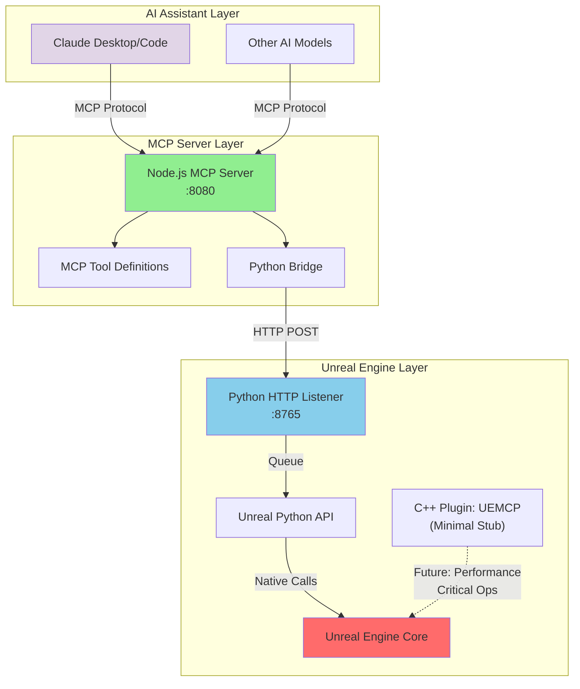

# UEMCP - Unreal Engine Model Context Protocol Server


A Model Context Protocol (MCP) server that provides AI models with deep integration capabilities for Unreal Engine projects. UEMCP bridges the gap between AI-powered development tools and Unreal Engine's complex ecosystem, enabling intelligent assistance for game development workflows.

## Features

### 🎮 Core Engine Integration
- **Project Management**: Create, load, and configure UE projects
- **Asset Pipeline**: Import, export, and manipulate game assets
- **Blueprint System**: Read and modify Blueprint graphs programmatically
- **Level Editing**: Automated level construction and actor placement
- **Build System**: Trigger builds, packaging, and deployment

### 🛠️ Development Tools
- **Code Generation**: Generate C++ classes, Blueprint nodes, and interfaces
- **Refactoring**: Intelligent code restructuring with UE conventions
- **Testing**: Automated test creation and execution
- **Documentation**: Generate and maintain project documentation

### 🔌 AI Model Support
- **Claude**: Full integration with Anthropic's Claude models
- **Gemini**: Google's Gemini model support
- **Cursor**: Enhanced IDE integration
- **Extensible**: Plugin architecture for additional AI models

## Architecture

### High-Level Architecture



### Data Flow

1. **AI Assistant** sends MCP commands to Node.js server
2. **Node.js MCP Server** validates and routes commands through the Python Bridge
3. **Python Bridge** makes HTTP requests to the Python Listener in Unreal
4. **Python HTTP Listener** queues commands for main thread execution
5. **Unreal Python API** executes commands on the main thread
6. Results flow back through the same chain

**Note**: The C++ plugin currently serves as a minimal stub to satisfy Unreal Engine's plugin requirements. All functionality is implemented through the Python API. Future versions may utilize the C++ plugin for performance-critical operations or features requiring native C++ APIs.

### Directory Structure

```
UEMCP/
├── server/           # MCP server implementation
│   ├── tools/        # UE-specific MCP tools
│   ├── resources/    # Project resources and templates
│   └── handlers/     # Request handlers
├── plugin/           # Unreal Engine plugin (C++)
│   ├── Source/       # C++ source code
│   ├── Content/      # Plugin assets
│   └── Config/       # Plugin configuration
├── python/           # Python utilities and bindings
│   ├── ue_api/       # Unreal Python API wrappers
│   ├── tools/        # Development tools
│   └── examples/     # Usage examples
└── docs/            # Documentation
```

## Installation

### Prerequisites
- Node.js 18+ and npm
- Unreal Engine 5.1+ (for full functionality)
- Python 3.8+ (optional, for extended features)
- Git

### 🚀 Quick Start (2 minutes)

1. **Clone and initialize**:
   ```bash
   git clone https://github.com/atomantic/UEMCP.git
   cd UEMCP
   node init.js
   ```

   That's it! The init script will:
   - ✅ Install all dependencies
   - ✅ Build the MCP server
   - ✅ Configure Claude Desktop automatically
   - ✅ Set up your Unreal Engine project path
   - ✅ Optionally install the UEMCP plugin to your project
   - ✅ Create test scripts

   **Advanced options**:
   ```bash
   # Install with plugin to specific project
   node init.js --project "/path/to/project" --install-plugin
   
   # Non-interactive installation
   node init.js --project "/path/to/project" --no-interactive --install-plugin
   
   # Server-only setup (no Claude config)
   node init.js --skip-claude
   ```

2. **Restart Claude Desktop** and test:
   - Say: "List available UEMCP tools"
   - Or: "Show me the assets in my Unreal project"

### Alternative Installation Methods

<details>
<summary>Platform-specific scripts</summary>

**macOS/Linux:**
```bash
./init.sh
```

**Windows PowerShell:**
```powershell
.\init.ps1
```
</details>

<details>
<summary>Manual installation</summary>

1. Install dependencies:
   ```bash
   cd server && npm install
   pip install -r requirements-dev.txt  # optional
   ```

2. Build the server:
   ```bash
   npm run build
   ```

3. Configure Claude Desktop:
   - Copy `claude-desktop-config.example.json` to:
     - macOS: `~/Library/Application Support/Claude/claude_desktop_config.json`
     - Windows: `%APPDATA%\Claude\claude_desktop_config.json`
     - Linux: `~/.config/claude/claude_desktop_config.json`
   - Update paths in the config file

4. Set environment variables:
   ```bash
   export UE_PROJECT_PATH="/path/to/your/unreal/project"
   ```
</details>

## Configuration

### Environment Variables

```bash
# Required
export UE_PROJECT_PATH="/path/to/your/unreal/project"

# Optional
export UE_INSTALL_LOCATION="/path/to/unreal/engine"
export DEBUG="uemcp:*"  # Enable debug logging
```

See [docs/environment-setup.md](docs/environment-setup.md) for detailed configuration options.

### Claude Desktop Configuration

The init script automatically configures Claude Desktop. For manual setup, see [claude-desktop-config.example.json](claude-desktop-config.example.json).

## 🔧 Troubleshooting

<details>
<summary>Claude doesn't see UEMCP tools</summary>

1. Ensure Claude Desktop is fully restarted (not just closed)
2. Check the config file exists:
   - macOS: `~/Library/Application Support/Claude/claude_desktop_config.json`
   - Windows: `%APPDATA%\Claude\claude_desktop_config.json`
3. Verify the server path in the config is correct
4. Run `node test-connection.js` to test the server locally
</details>

<details>
<summary>"Python not found" warning</summary>

Python is optional. Core features work without it. To enable Python features:
- Install Python 3.8+
- Run: `pip install -r requirements-dev.txt`
</details>

<details>
<summary>Build errors during init</summary>

1. Ensure Node.js 18+ is installed: `node --version`
2. Clear npm cache: `npm cache clean --force`
3. Delete `node_modules` and try again
4. Check for TypeScript errors: `cd server && npm run build`
</details>

## Available Tools

Once connected, Claude can use these UEMCP tools:

- **project.create** - Create new Unreal Engine projects
- **project.info** - Get information about the current project
- **asset.list** - List project assets (coming soon)
- **blueprint.create** - Create Blueprint classes (coming soon)
- **level.edit** - Edit levels and place actors (coming soon)
    "asset_management": true,
    "level_editing": true,
    "code_generation": true
  }
}
```

### AI Client Setup

#### Claude Desktop
Add to your `claude_desktop_config.json` (located in `~/Library/Application Support/Claude/` on macOS):
```json
{
  "mcpServers": {
    "uemcp": {
      "command": "node",
      "args": ["/path/to/UEMCP/server/dist/index.js"],
      "env": {
        "UE_PROJECT_PATH": "/path/to/your/project.uproject"
      }
    }
  }
}
```

#### Claude Code (claude.ai/code)
Use the `claude mcp` CLI or configure manually:

**Option 1: Using claude mcp CLI**
```bash
# Install claude-mcp if not already installed
npm install -g @anthropic/claude-mcp

# Add the UEMCP server
claude mcp add uemcp \
  --command "node" \
  --args "/path/to/UEMCP/server/dist/index.js" \
  --env "UE_PROJECT_PATH=/path/to/your/project.uproject"

# Verify configuration
claude mcp list
```

**Option 2: Manual configuration**
Add to `~/.config/claude/mcp_servers.json`:
```json
{
  "servers": {
    "uemcp": {
      "command": "node",
      "args": ["/path/to/UEMCP/server/dist/index.js"],
      "env": {
        "UE_PROJECT_PATH": "/path/to/your/project.uproject"
      },
      "enabled": true
    }
  }
}
```

#### Cursor
Configure in your workspace settings:
```json
{
  "mcp.servers": [
    {
      "name": "uemcp",
      "command": ["node", "/path/to/UEMCP/server/dist/index.js"]
    }
  ]
}
```

## Available Tools

### Current Implementation
The following tools are currently implemented and available:

#### Asset Management
- `asset_list` - List assets in the Unreal Engine project with filtering options
  - Filter by path (e.g., `/Game/Blueprints`)
  - Filter by asset type (Blueprint, Material, Texture2D, etc.)
  - Recursive search support

#### Blueprint System
- `blueprint_create` - Create new Blueprint classes
  - Specify parent class (Actor, Pawn, Character, GameMode)
  - Set custom blueprint name and path
  - Automatic compilation

#### Project Management
- `project_create` - Create new Unreal Engine projects (mock implementation)
  - Choose project template (Blank, FirstPerson, ThirdPerson, VR, TopDown)
  - Set project name and location
  - Specify engine version

### Planned Tools (Coming Soon)

#### Asset Management
- `asset_import` - Import external assets into the project
- `asset_export` - Export assets from the project
- `material_create` - Generate new materials
- `texture_modify` - Edit texture properties

#### Blueprint System
- `blueprint_modify` - Edit existing Blueprint graphs
- `blueprint_compile` - Compile and validate Blueprints
- `blueprint_analyze` - Analyze Blueprint complexity and dependencies

#### Level Editing
- `level_create` - Generate new levels
- `actor_place` - Add actors to levels
- `landscape_modify` - Edit terrain and landscapes
- `lighting_build` - Build lighting for levels

#### Code Generation
- `cpp_class_create` - Generate C++ classes with UE boilerplate
- `interface_create` - Create UE interfaces
- `bindings_generate` - Create Python/Blueprint bindings
- `code_refactor` - Intelligent code refactoring

#### Project Management
- `project_info` - Get comprehensive project information
- `project_build` - Build the project
- `project_package` - Package for distribution
- `tests_run` - Execute automated tests

## Usage Examples

### Listing Assets
With Claude Desktop or Claude Code, you can use natural language:
- "Show me all blueprints in my Unreal project"
- "List assets in /Game/Characters"
- "What materials are in the project?"

Or use the tool directly:
```json
{
  "tool": "asset_list",
  "arguments": {
    "path": "/Game/Characters",
    "assetType": "Blueprint",
    "recursive": true
  }
}
```

### Creating Blueprints
Natural language examples:
- "Create a new Actor blueprint called BP_Platform"
- "Make a Character blueprint named BP_Enemy in /Game/Enemies"
- "Create a GameMode blueprint"

Direct tool usage:
```json
{
  "tool": "blueprint_create",
  "arguments": {
    "name": "BP_PlayerCharacter",
    "path": "/Game/Blueprints",
    "parentClass": "Character"
  }
}
```

### Project Creation (Mock)
```json
{
  "tool": "project_create",
  "arguments": {
    "projectName": "MyNewGame",
    "projectPath": "/Users/username/Documents/Unreal Projects",
    "engineVersion": "5.6",
    "template": "FirstPerson"
  }
}
```

## Development

### Building from Source
```bash
# Install development dependencies
npm install --dev
pip install -r requirements-dev.txt

# Build the UE plugin
python scripts/build_plugin.py

# Run tests
npm test
python -m pytest tests/
```

### Plugin Development
The C++ plugin provides the core UE integration. Key components:

- **UEMCPSubsystem**: Main subsystem for MCP communication
- **UEMCPBlueprintLibrary**: Blueprint-accessible functions
- **UEMCPCommandlet**: Command-line tools for automation
- **UEMCPSettings**: Configuration management

### Contributing
1. Fork the repository
2. Create a feature branch (`git checkout -b feature/amazing-feature`)
3. Commit your changes (`git commit -m 'Add amazing feature'`)
4. Push to the branch (`git push origin feature/amazing-feature`)
5. Open a Pull Request

## Supported Unreal Engine Versions

| UE Version | Status | Notes |
|------------|---------|-------|
| 5.4+ | ✅ Full Support | Recommended |
| 5.3 | ✅ Full Support | Stable |
| 5.2 | ⚠️ Limited Support | Some features unavailable |
| 5.1 | ⚠️ Limited Support | Basic functionality only |
| 5.0 | ❌ Not Supported | - |

## Roadmap

### Phase 1 - Core Foundation ✅
- [x] Basic MCP server implementation
- [x] UE Python API integration
- [x] Essential tools (project, asset, blueprint)
- [x] AI model compatibility

### Phase 2 - Advanced Features 🚧
- [ ] Visual scripting assistance
- [ ] Performance profiling integration
- [ ] Automated testing framework
- [ ] Asset optimization tools

### Phase 3 - Ecosystem Integration 📋
- [ ] Version control integration
- [ ] CI/CD pipeline support
- [ ] Marketplace integration
- [ ] Team collaboration features

## Troubleshooting

### Common Issues

**MCP Server Won't Start**
- Verify Node.js version (18+)
- Check that UE project path is correct
- Ensure Python is available in PATH

**Python API Not Working**
- Enable Python plugins in UE Editor
- Verify Python paths in project settings
- Check UE Python console for errors

**Tool Execution Fails**
- Ensure UE Editor is running
- Check MCP server logs
- Verify tool permissions

### Debug Mode
Enable verbose logging:
```bash
DEBUG=uemcp:* npm start
```

## License

This project is licensed under the MIT License - see the [LICENSE](LICENSE) file for details.

## Acknowledgments

- [Model Context Protocol](https://modelcontextprotocol.io/) by Anthropic
- [Unreal Engine](https://www.unrealengine.com/) by Epic Games
- The open-source game development community

## Support

- 📖 [Documentation](https://github.com/atomantic/UEMCP/wiki)
- 🔧 [Claude Code Setup Guide](./docs/claude-code-mcp-setup.md)
- 🐛 [Issues](https://github.com/atomantic/UEMCP/issues)
- 💬 [Discussions](https://github.com/atomantic/UEMCP/discussions)
- 📧 Contact: [Your Email]

---

*Built with ❤️ for the Unreal Engine and AI development communities*